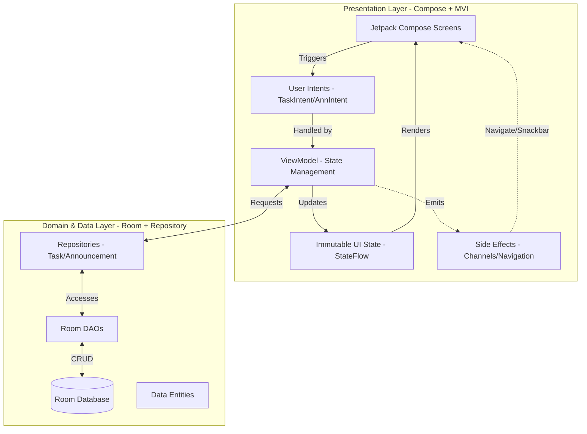

# 🎓 Smart Campus Companion - Phase 2 (Midterm)

## 📱 App Overview
The **Smart Campus Companion** is a robust mobile solution designed to streamline the university experience. In Phase 2, we have transitioned from static layouts to a dynamic, data-driven architecture, focusing on personal organization and campus-wide communication.

### ✨ Key Features (Midterm Update)
*   **📅 Task & Schedule Manager:**
    *   **Full CRUD Operations:** Add, view, edit, and delete academic tasks.
    *   **Smart Scheduling:** Integrated Date and Time pickers driven by UI state.
    *   **Organized UI:** Tasks are rendered using `LazyColumn` with state-aware completion toggles and strike-through animations.
*   **📢 Campus Announcements Module:**
    *   **Persistent Updates:** Real-time campus news stored locally using Room Database.
    *   **Read/Unread Tracking:** Visual indicators (badges and opacity changes) for new announcements.
    *   **Detail View:** Rich text expanded views for deep-diving into campus events.
*   **🌓 Adaptive UI:**
    *   **Dynamic Theme Toggle:** Manual switch between Light and Dark modes.
    *   **Material 3 Design:** Professional gradients and elevated card layouts for a premium feel.

---

## 👥 Team Composition & Roles
*   **Team Leader:** [Your Name] - *Project oversight and architectural decisions.*
*   **Git Manager:** [Member Name] - *Branch management, PR reviews, and conflict resolution.*
*   **UI/UX Developer:** [Member Name] - *Material 3 implementation and Dark Mode theming.*
*   **Feature Developer:** [Member Name] - *Room DB setup, DAOs, and MVI business logic.*
*   **QA / Documenter:** [Member Name] - *Testing, Bug tracking, and README maintenance.*

---

## 🏗️ Technical Architecture
The project strictly implements **MVVM** enhanced with the **MVI (Model-View-Intent)** pattern to ensure predictable state management and high testability.

### 📊 Architecture Diagram

### 🛠️ Technical Focus
*   **State as Source of Truth:** A single immutable `UiState` object controls every pixel on the screen.
*   **Unidirectional Data Flow (UDF):** User actions flow up as Intents; data updates flow down as State.
*   **Local Persistence:** Room Database with version-controlled migrations for reliable data storage.
*   **Dependency Injection:** Powered by **Hilt** for scalable and testable code.

---

## 🚀 Git Workflow & Requirements
*   **Primary Branches:** `main` (Production), `develop` (Integration).
*   **Feature Branches:** `feature/task-manager`, `feature/announcements`.
*   **Collaboration:** Used Pull Requests (PRs) for all merges into `develop`.
*   **Release Tag:** `v1.0-midterm`

---

## 📝 Reflection Document

### 🔍 Git Challenges & Learning Curve
One of the most significant challenges during this phase was the shift to a team-based development environment. Specifically, managing **Database Schema Changes** across multiple branches was difficult. When the `feature/task-manager` developer added a `Task` entity and the `feature/announcements` developer added an `Announcement` entity, the shared `AppDatabase.kt` became a hotspot for errors. We learned that communication is just as important as code—notifying the team before changing shared configuration files is vital.

### ⚔️ Conflict Resolution Case Study
We encountered a major merge conflict in `NavGraph.kt` and `AppDatabase.kt` during the final integration.

**The Conflict:**
Both features attempted to modify the same line in `AppDatabase` to include their respective DAOs and Entities. Additionally, the database version number was incremented differently on both branches.

**The Resolution:**
1.  **Stop & Sync:** We paused all active development on feature branches.
2.  **Manual Merge:** The Git Manager used the IDE's Merge Tool to manually accept both sets of entities and DAOs.
3.  **Standardization:** We agreed on a final version (`v12`) to ensure all migrations triggered correctly.
4.  **Verification:** We performed a clean build and verified that both the Task list and Announcement list were populating correctly before finalizing the merge.

---
**Status:** ✅ Phase 2 Completed | **Target:** Finals Period Integration
