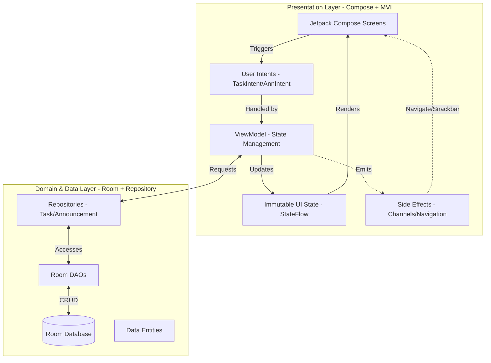

## 📊 Architecture Diagram

## 📝 Reflection Document

### 🔍 Git Challenges & Learning Curve
One of the most significant challenges during this phase was the shift to a team-based development environment. Specifically, managing **Database Schema Changes** across multiple branches was difficult. When the `feature/task-manager` developer added a `Task` entity and the `feature/announcements` developer added an `Announcement` entity, the shared `AppDatabase.kt` became a hotspot for errors. We learned that communication is just as important as code—notifying the team before changing shared configuration files is vital.

### ⚔️ Conflict Resolution Case Study
We encountered a major merge conflict in `NavGraph.kt` and `AppDatabase.kt` during the final integration.

**The Conflict:**
Both features attempted to modify the same line in `AppDatabase` to include their respective DAOs and Entities. Additionally, the database version number was incremented differently on both branches.

**The Resolution:**
1.  **Stop & Sync:** We paused all active development on feature branches.
2.  **Manual Merge:** The Git Manager used the IDE's Merge Tool to manually accept both sets of entities and DAOs.
3.  **Standardization:** We agreed on a final version (`v12`) to ensure all migrations triggered correctly.
4.  **Verification:** We performed a clean build and verified that both the Task list and Announcement list were populating correctly before finalizing the merge.

---

# 📝 Project Reflection

[⬅ Back to README](README.md)
